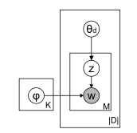
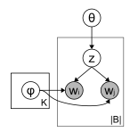

## Biterm Topic Model 模型部分

与LDA不同，BTM（Biterm Topic Model）依据**整个语料库**中的**词对**学习主题，以解决短文本的 *文档稀疏性问题* 。

假设，整个语料库是主题的混合体，每个词对独立的来自于某一特定主题。主题生成过程如下：

1. 首先对各个主题z，随机生成其主题所属的 **词汇dirichlet分布:$\phi_z$** .
    - $\phi_z \sim \text{Dir}(\beta)$ 
    - $\phi_z$可以视为一个概率向量，其符合Dirichlet分布，每个属于主题z的词的概率均从这个Dirichlet分布中抽取。
2. 随机生成整个语料库**主题的dirichlet概率分布:$\theta$**
    - $\theta \sim \text{Dir}(\alpha)$
3. 根据step.1和2得出的主题词汇分布$\phi_z$和语料库主题分布$\theta$, 抽取一个主题$z$和主题$z$内的两个词汇$w_i w_j$（词对）
    1. $z \sim \text{Multi}(\theta)$
    2. $w_i,w_j \sim \text{Multi}(\phi_z)$

### 词对联合概率

由如上过程抽取出的词对$b = (w_i, w_j)$概率如下:

$$
P(b) = \sum_z P(z)P(w_i|z)P(w_j|z) \\
= \sum_z \theta_z \phi_{i|z} \phi_{j|z}
$$

可以看出，依据整个语料库进行词对概率建模可以很大程度上解决短文本的稀疏性问题。这也是Biterm与LDA主要的差异所在，如图，LDA依据文档内的单个词进行建模，而Biterm是依据整个语料库的词对进行建模的。从某种程度上来说，LDA描述的是**文档级别的词汇共现**，而Biterm描绘的是**词对级别的共现**。

<figure>
    
    <figcaption>Fig.1 - LDA Topic Model</figcaption>
</figure>
<figure>
    
    <figcaption>Fig.2 - Biterm Topic Model</figcaption>
</figure>

## 推断文档主题

由于BTM基于词对建模，所以其无法像LDA一样直接获取文档主题比例。所以BTM假设，文档的主题比例等于**文档中 词对的主题比例 的期望**。即

$$
P(z|d) = \sum_b P(z|b)P(b|d)
$$

依据贝叶斯定理，上式中的 $P(z|b)$可以由如下得出：

$$
P(z|b) = \frac{P(z)P(w_i|z)P(w_j|z)}{\sum_z P(z)P(w_i|z)P(w_j|z)}
$$

而上式中的 $P(b|d)$ 由如下给出，其通过经验函数近似：

$$
p(b|d) = \frac{n_d(b)}{\sum_b n_d(b)}
$$

即分子为文档d中词对b的频数，分母为文档d中所有词对出现的总次数以归一化。

## 参数推断

参数推断部分其采用了Gibbs Sampling 吉布斯采样算法，以推断主题分布参数$\theta$和主题词汇分布参数$\phi$。

## 总结

BTM总体和LDA一样，随机生成dirichlet分布，利用吉布斯采样求解分布参数，最后利用贝叶斯定理反推文档的主题概率，其中最主要的区别是LDA基于文档级数据建模，而BTM基于词对数据对整个语料库进行建模，这意味着BTM很好的解决的短文本，如Weibo，弹幕等 短文本，稀疏数据的主题推断。
