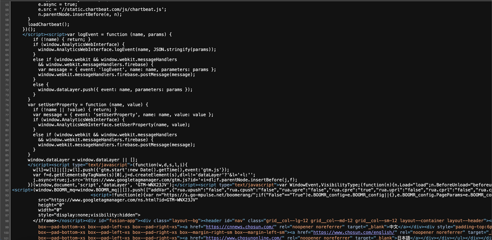
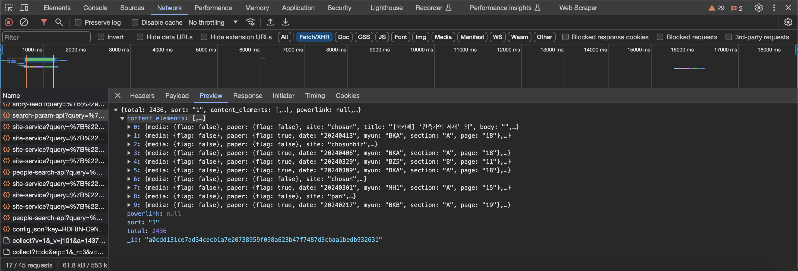
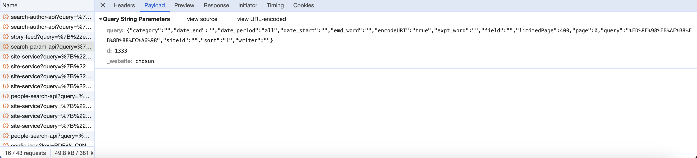

本文对朝鲜日报(chosun.com，조선일보)的文章搜索API进行分析，并使用Python构建请求爬虫。

## URL/ HTTP Request Analysis

首先，导航至朝鲜日报的搜索页面，其URL构造如下（以 페미니즘 为例）：

```
https://www.chosun.com/nsearch/?query=%ED%8E%98%EB%AF%B8%EB%8B%88%EC%A6%98&page=1&siteid=&sort=1&date_period=&date_start=&date_end=&writer=&field=&emd_word=&expt_word=&opt_chk=false&app_check=0&website=www,chosun&category=
```

基本URL为 https://www.chosun.com/nsearch/ ，可以看出get请求包含了许多参数，其中query值的URL Encode能看出其代表搜索关键词。

此时其实可以直接通过构造URL发送HTTP GET请求，但通过对网页的粗略判断，朝鲜日报使用js异步加载，即使直接获取了此URL返回的HTML内容，也很难对其进行提取。



上图为搜索页面的源码，可以看出由于js异步技术，其文本内容被js结构包含，获取到我们想要的信息过程过于繁杂，且将造成大量的内存占用。因此对此页面进行抓包，找出异步请求部分的API请求，并尝试用Python构造真正的API请求。

使用Chrome自带的检查工具可以轻松检视页面的http请求，筛选XHR类型，很轻松找到了API地址，其返回结果如下



可以看出返回的json数据包含了此搜索页的10条新闻搜索结果，并且其是通过get请求，通过parameters传递搜索参数，搜索参数结构如下



即所有的搜索参数由json结构构建作为query参数的值传入get请求。

接下来使用Python构造请求并解析其返回的json及其元数据就可以了。


## Python requests包构建API请求

```python
def chosun_get_page_list():
    
    API_URL = 'https://www.chosun.com/pf/api/v3/content/fetch/search-param-api'
    
    headers = {'User-Agent':'Mozilla/5.0 (Macintosh; Intel Mac OS X 10_15_7) AppleWebKit/537.36 (KHTML, like Gecko) Chrome/122.0.0.0 Safari/537.36'}
    
    api_params = dict()
    
    api_params['category'] = ""
    api_params['page'] = 0
    api_params['query'] = quote("페미니즘") #query string must be urlencoded 
    total_pages = 0
    
    query_str = dumps(api_params,separators=(",", ":")) #remove blank after dict , or : 
    params = dict(query=query_str) #embed query dict in url params 
    
    res = req.get(API_URL, headers=headers, params=params)
    
    if res.status_code == 200:
        total_pages = res.json()['total'] // 10 #total articles number / 10 (1 page 10 articles)
    
    for i in range(total_pages):
        api_params['page'] += 1
        res = req.get(API_URL, headers=headers, params=params)
        yield res.json().get('content_elements')
```

需要注意的是，参数值json里面的query，其代表着搜索关键词，其值是URLEncode后的，所以需要先对关键词字符串进行URL编码，编码后放入json中，整个json作为值传入get请求的query参数中，并将请求参数一并通过requests的get方法发送到服务器，在这个过程中，requests会自动对get请求参数param做URLEncode，所以说get请求query参数内的query关键词实际上是通过了两次URLEncode后的。

请求包构造完成后，循环对每一页进行请求就可以了，请求页数由json的page参数决定，而总页数可以通过请求返回的total参数计算，每页10page，因此用total//10计算出总页数就行了。

利用for循环直到最后一页，每次循环返回当前页的10篇文章列表，此部分由Python生成器功能实现，好处是动态计算并且在使用notebook运行时可以使用tqdm监控爬虫过程。


