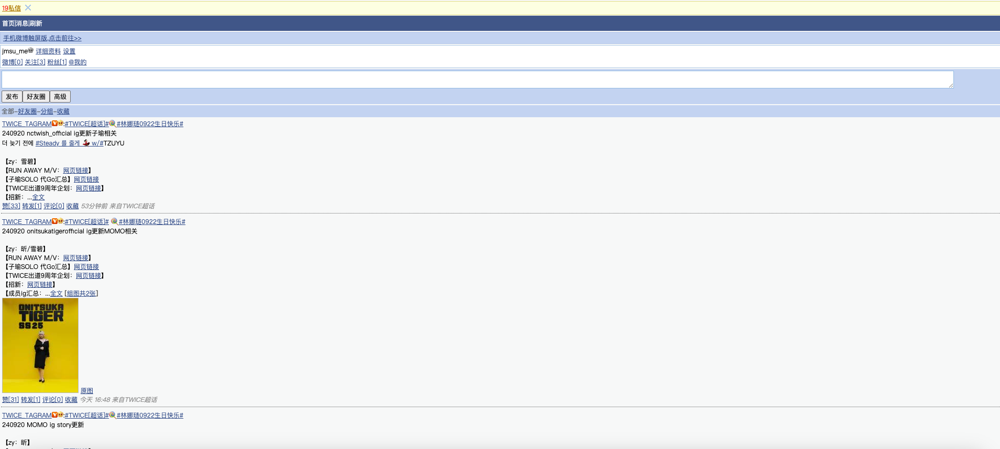
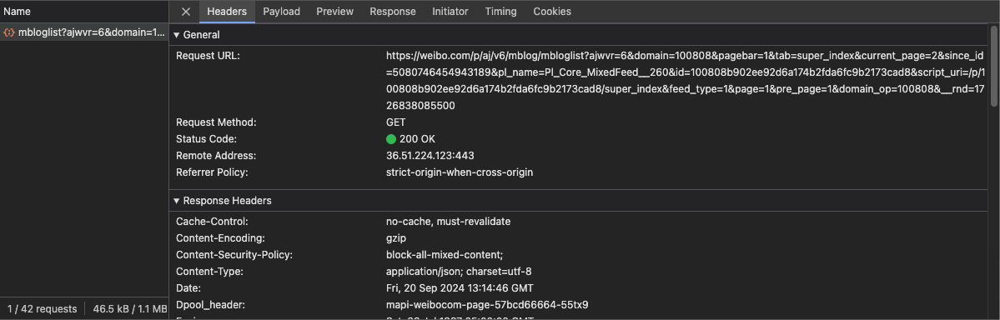
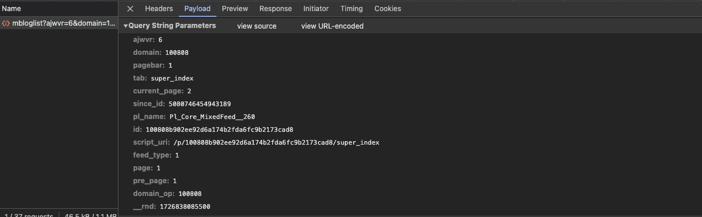

## 微博超话网页端

微博的网页端基本有三个地址，对应着三种后端

1. [weibo.cn](https://weibo.cn)
2. [weibo.com](https://weibo.com)
3. [m.weibo.cn](https://m.weibo.cn)

### weibo.cn

其中，weibo.cn是比较古老的接口，因为其并不是异步加载，所以不存在后端API，爬取逻辑是直接对网页结构进行解析，提取数据，相比于其他方案需要耗费更多的本地资源，并且需要注意的是，大规模数据爬取时，weibo.cn对爬虫速率的限制比较严重，因此不推荐使用此方案。并且此方案并没有提供任何可以爬取微博超话的方案。



### weibo.com *主要使用的接口

用户使用PC端访问超话的默认接口，其采用了异步加载html代码的方式，而不是直接加载数据，这意味虽然其提供了API接口，但是我们依旧需要手动解析返回的内容，因为其返回的不是json数据格式，而是通过服务器后端加载好的html代码格式。但是我们依旧采用此接口进行爬取，原因如下：

1. 其提供了所有时间段的微博超话文章数据 （可以进行全数调查）
2. 较快的爬取速率 （约 1request/min）


### m.weibo.cn

移动端微博的默认接口，现代化的web架构，前后端数据分离，因此可以直接通过API获取数据，不需要手动解析，但其缺点是无法进行全数调查，因为数据会在某时间段截止，无法获取某时间段之前的数据。


## weibo.com 超话接口解析

### 获取Supertopic超话 ID

每个超话都有其独有的ID，可以通过weibo.com的URL查看

如 TWICE超话的地址：

https://weibo.com/p/100808b902ee92d6a174b2fda6fc9b2173cad8/super_index

其中’100808b902ee92d6a174b2fda6fc9b2173cad8‘便是其独有的超话ID

### 超话异步加载接口

异步接口地址为

https://weibo.com/p/aj/v6/mblog/mbloglist

当我们向下滚动翻页，前端会通过这个接口请求下一段的html代码。




#### 接口参数



- id
    - 填入超话的独有id，即上节介绍的supertopicid
- domain
    - 超话独有id的前6位，即id[:6]
- domain_op
    - 同上

**接下来是能正常获取数据的关键！请仔细阅读**

- current_page
    - 值从0～2循环 
    - 其代表的是**当页的异步翻页次数！** 
    - 网页的翻页逻辑是，用户向下滚动页面，经历两次滚动的自动异步加载后，需要用户手动点击下一页。因此第一次滚动异步加载的值为0，然后为1，然后为2，循环往复。
    - 其与pagebar参数联动！
- pagebar
    - 代表本次请求的html代码是否包含手动翻页部分
    - 因此，即只有在current_page参数为2的时候，pagebar一定为1，否则为0
- page
    - 代表当前是第几页
    - 其代表的是用户手动翻页的页数
- prepage
    - 需要注意的是，**需要保持prepage与page相同**，而不是page-1！

总结来说，翻页逻辑是

```python
for page in range(0,n):
    prepage = page
    for current_page in range(0,3):
        if pagebar == 2:
            pagebar = 1
        else:
            pagebar = 0
```

- sinceid
    - 由上一次请求返回的数据中提供
- __rnd
    - 当前时间戳，防止服务器端返回缓存的内容

**如果没有按照上述逻辑按照顺序发送请求，服务器将返回重复的，不正确的html代码且不会发生错误！请仔细检查服务器的返回数据验证请求的正确性！**

另外需要注意的是，服务器有时会返回data为空的结果，导致爬虫链中断，无法继续获取后续文章，因此建议手动添加一层判断，如果data为空，sleep一分钟后重试当前请求，以此提升大规模超话文章爬取的，整体爬虫的稳健型！


---

具体的代码将不在此处提供，推荐使用scrapy进行爬虫的构建，如果您对weibo超话数据感兴趣或对社会学大数据感兴趣，欢迎通过邮箱联系我！

如果本文对您有很大的帮助，您可以选择请我喝杯咖啡 :)

<script type="text/javascript" src="https://cdnjs.buymeacoffee.com/1.0.0/button.prod.min.js" data-name="bmc-button" data-slug="jmsu" data-color="#FFDD00" data-emoji=""  data-font="Cookie" data-text="Buy me a coffee" data-outline-color="#000000" data-font-color="#000000" data-coffee-color="#ffffff" ></script>


