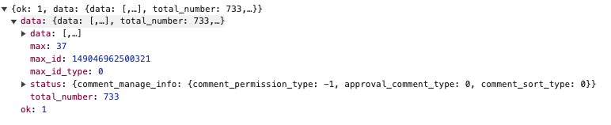

## 移动网页端 m.weibo.cn 评论接口

对于每个post，移动端都对应着一个唯一的post_id，将其称为m_post_id，可以通过移动端文章详情页的URL获得：

如 https://m.weibo.cn/detail/5044406111175959

最后的一串数字就是每篇文章独有的m_post_id

### hotflow API

依据m_post_id通过如下接口可以获取文章的**根评论**信息，需要注意的是，**子评论**并不包含在此接口中！

- api-url：https://m.weibo.cn/comments/hotflow?id=5044406111175959&mid=5044406111175959&max_id_type=0

可以看出其包含三个参数，分别是
- id
- mid
- max_id_type

id和mid全都指 m_post_id，max_id_type默认为0

初始请求并不需要Cookie用户登陆，但是大体量爬虫情况下推荐在此处也使用Cookie登陆，否则将会跳转很多次302到用户验证，大幅度降低爬虫速度。

Response结果如下：

data内需要关注的是：data list（每条评论的具体信息），max_id, max_id_type三个参数

其中max_id, max_id_type用于翻页，weibo的后端评论信息使用的是类似链表的链式结构，我们需要依据每次response返回的max_id和max_id_type构造下一次翻页请求，当Response的max_id返回0时，代表着没有后续数据了。

